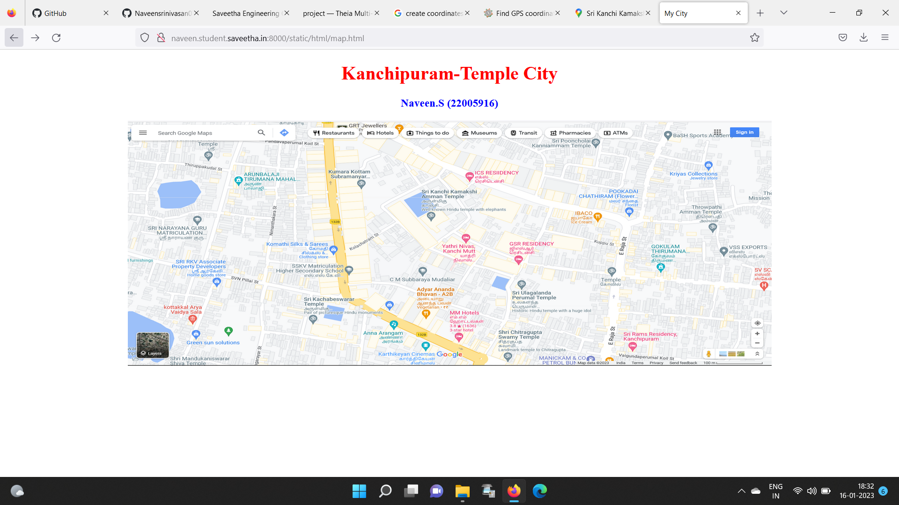
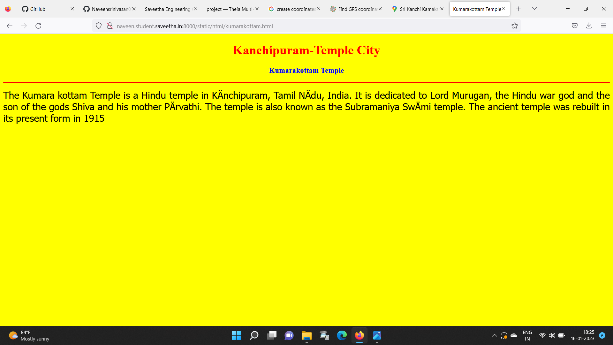
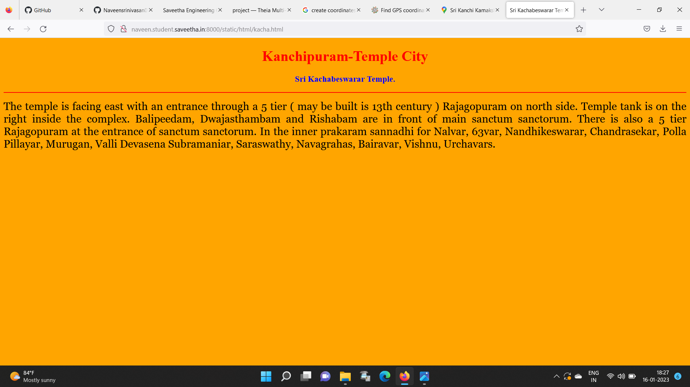
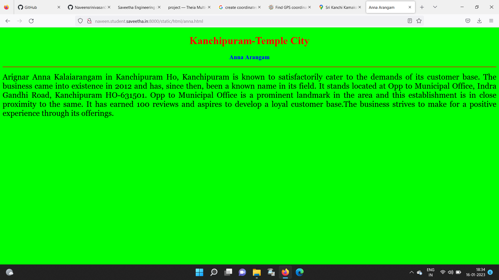
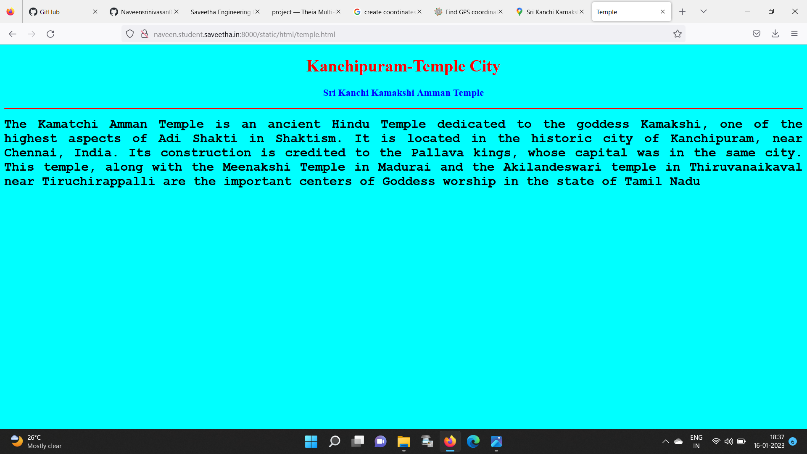
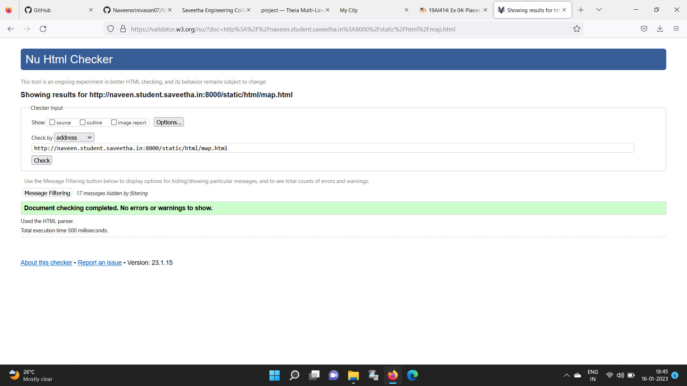

# Places Around Me
## AIM:
To develop a website to display details about the places around my house.

## Design Steps:

### Step 1:
clone the github repository into theia IDE
### Step 2:
create a new django project
### Step 3:
write the needed html code
### Step 4:
run the django server and excute the html files
## Code:
```
map.html
<!DOCTYPE html>
<html lang="en">
<head>
<title>My City</title>
</head>
<body>
<h1 align="center">
<font color="red"><b>Kanchipuram-Temple City</b></font>
</h1>
<h3 align="center">
<font color="blue"><b>Naveen.S (22005916)</b></font>
</h3>
<center>

<map name="MyCity">
<area shape="circle" coords="190,50,20" href="/static/html/temple.html" title="Sri Kanchi Kamakshi Amman Temple">
<area shape="rectangle" coords="230,30,260,60" href="/static/html/anna.html" title="Anna Arangam">
<area shape="circle" coords="400,200,75" href="/static/html/kacha.html" title="Sri Kachabeswarar Temple.">
<area shape="circle" coords="400,200,75" href="/static/html/sskv.html" title="SSKV Matriculation Higher Secondary School">
<area shape="rectangle" coords="490,150,870,320" href="/static/html/kumarakottam.html" title="Kumarakottam Temple">
</maap>
</center>
</body>
</html>

kacha.html

<!DOCTYPE html>
<html lang="en">
<head>
<title>Sri Kachabeswarar Temple.</title>
</head>
<body bgcolor="orange">
<h1 align="center">
<font color="red"><b>Kanchipuram-Temple City</b></font>
</h1>
<h3 align="center">
<font color="blue"><b>Sri Kachabeswarar Temple.</b></font>
</h3>
<hr size="3" color="red">
<p align="justify">
<font face="Georgia" size="5">
The temple is facing east with an entrance through a 5 tier ( may  be built is 13th century ) Rajagopuram on north side.
Temple tank is on the right inside the complex.  Balipeedam, Dwajasthambam and Rishabam are in front of main sanctum sanctorum.
There is  also a 5 tier Rajagopuram at the entrance of  sanctum sanctorum.
In the inner prakaram sannadhi for Nalvar, 63var, Nandhikeswarar, Chandrasekar, Polla Pillayar, Murugan, Valli Devasena
Subramaniar, Saraswathy, Navagrahas, Bairavar, Vishnu, Urchavars.
</font>
</p>
</body>
</html>

anna.html
<!DOCTYPE html>
<html lang="en">
<head>
<title>Anna Arangam</title>
</head>
<body bgcolor="lime">
<h1 align="center">
<font color="red"><b>Kanchipuram-Temple City</b></font>
</h1>
<h3 align="center">
<font color="blue"><b>Anna Arangam</b></font>
</h3>
<hr size="3" color="red">
<p align="justify">
<font face="Georgia" size="5">
Arignar Anna Kalaiarangam in Kanchipuram Ho, Kanchipuram is known to satisfactorily cater to the demands of its customer base.
The business came into existence in 2012 and has, since then, been a known name in its field. It stands located at Opp to
Municipal Office, Indra Gandhi Road, Kanchipuram HO-631501. Opp to Municipal Office is a prominent landmark in the area
and this establishment is in close proximity to the same. It has earned 100 reviews and aspires to develop a loyal customer
base.The business strives to make for a positive experience through its offerings.
</font>
</p>
</body>
</html>
 
 sskv.html

 <!DOCTYPE html>
<html lang="en">
<head>
<title>SSKV Matriculation Higher Secondary School</title>
</head>
<body bgcolor="pink">
<h1 align="center">
<font color="red"><b>Kanchipuram-Temple City</b></font>
</h1>
<h3 align="center">
<font color="blue"><b>SSKV Matriculation Higher Secondary School</b></font>
</h3>
<hr size="3" color="red">
<p align="justify">
<font face="Arial" size="5">
<b>
Established in year 1904, SSKV (Aided) HSS(G)., Kanchipuram is located in Urban area of Tamil Nadu state/ut of India.
In Kancheepuram area of Kanchipuram block of Kancheepuram district. Area pincode is 631502.
School is providing Upper Primary, Secondary, High Secondary (6-12) level education and
is being managed by Private Aided Organisation.
Medium of instruction is Tamil, English language and school is for Girls only.
Currently schools is being guided by principal/head teacher Mr./Ms. G.K.DHANALAKSHMI.
School is affiliated with State Board for both secondary and high secondary level.
</b>
</font>
</p>
</body>
</html>

kumarakottam.html

<!DOCTYPE html>
<html lang="en">
<head>
<title>Kumarakottam Temple </title>
</head>
<body bgcolor="yellow">
<h1 align="center">
<font color="red"><b>Kanchipuram-Temple City</b></font>
</h1>
<h3 align="center">
<font color="blue"><b>Kumarakottam Temple </b></font>
</h3>
<hr size="3" color="red">
<p align="justify">
<font face="Tahoma" size="5">
The Kumara kottam Temple is a Hindu temple in Kānchipuram,
Tamil Nādu, India. It is dedicated to Lord Murugan,
the Hindu war god and the son of the gods Shiva and his mother Pārvathi. 
The temple is also known as the Subramaniya Swāmi temple.
The ancient temple was rebuilt in its present form in 1915
</font>
</p>
</body>
</html>

temple.html
<!DOCTYPE html>
<html lang="en">
<head>
<title>Temple</title>
</head>
<body bgcolor="cyan">
<h1 align="center">
<font color="red"><b>Kanchipuram-Temple City</b></font>
</h1>
<h3 align="center">
<font color="blue"><b>Sri Kanchi Kamakshi Amman Temple</b></font>
</h3>
<hr size="3" color="red">
<p align="justify">
<font face="Courier New" size="5">
<b>
The Kamatchi Amman Temple is an ancient Hindu Temple dedicated to the goddess Kamakshi,
one of the highest aspects of Adi Shakti in Shaktism. It is located in the historic city of Kanchipuram,
near Chennai, India. Its construction is credited to the Pallava kings, whose capital was in the same city.
This temple, along with the Meenakshi Temple in Madurai and the Akilandeswari temple in Thiruvanaikaval 
near Tiruchirappalli are the important centers of Goddess worship in the state of Tamil Nadu
</b>
</font>
</p>
</body>
</html>
```

## Output:











## HTML Validator



## Result:
the program for implementing image map is executed sucessfully